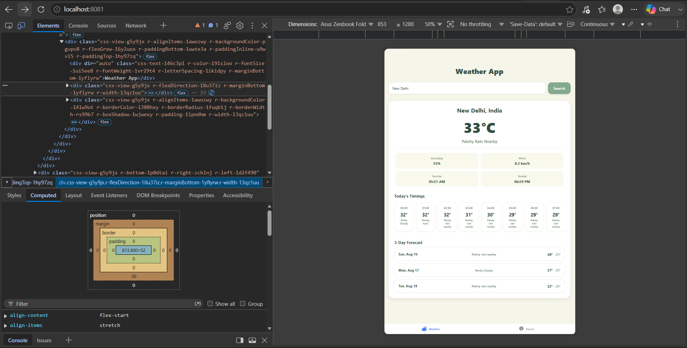

🌤️ React Native Weather Dashboard

A robust, cross-platform weather application built with **React Native** and the **Expo** framework (SDK 57). Designed with a calming, minimalist "Earth Tone" aesthetic, this app provides real-time meteorological data, hourly timelines, and multi-day forecasts for any global location using **WeatherAPI**.

---
📱 Visual Previews

Here is how the application adapts seamlessly across different screen sizes:

### Mobile View


### Tablet / Web View


---
✨ Core Features

* **🌍 Global City Search:** Instantly retrieve weather conditions for any city worldwide.
* **🌡️ Real-Time Conditions:** Current temperature, weather descriptions, humidity percentages, and wind speeds.
* **🌅 Astronomical Data:** Accurate sunrise and sunset timings for the selected location.
* **⏱️ Hourly Timeline:** A horizontally scrolling carousel displaying hourly temperature and condition trends.
* **📅 3-Day Forecast:** Detailed min/max temperatures and daily weather outlook for the next three days.
* **🎨 Earth Tone UI:** Clean styling built with a soft beige background (`#F5F5E9`), crisp white cards (`#FFFFFF`), and sage green accents (`#84A98C`).
* **📱 Universal Platform Support:** Responsive across iOS, Android, and Web using Expo Router.

---

🛠️ Tech Stack

* **Framework:** [React Native](https://reactnative.dev/)
* **Toolchain & Routing:** [Expo](https://expo.dev/) (SDK 57) / Expo Router
* **Language:** TypeScript / TSX
* **Data Fetching:** Native `fetch` API
* **API Provider:** [WeatherAPI.com](https://www.weatherapi.com/) (`forecast.json` endpoint)

---

 📁 Project Structure

```text
weather-app/
├── assets/                 # Icons, splash screens, and images
├── src/
│   └── app/
│       ├── _layout.tsx     # Root navigation & layout
│       └── index.tsx       # Main weather screen & fetching logic
├── app.json                # Expo project configuration
├── package.json            # Dependencies & scripts
└── README.md               # Project documentation

```

---

 🧰 Troubleshooting & Known Issues

**Dependency Conflicts (React / React Native version mismatches):**
If dependency issues occur after forced audits, clean and rebuild using Expo's toolchain:

```powershell
# 1. Remove corrupted dependencies
Remove-Item -Recurse -Force node_modules

# 2. Install base Expo package
npm install expo --legacy-peer-deps

# 3. Align all package versions
npx expo install --fix

```

---

 📝 License

This project is open-source and available under the [MIT License](https://www.google.com/search?q=LICENSE).

---

🚀 Getting Started

### 1. Install dependencies:

```bash
npm install

```

*(Note: If you run into peer dependency conflicts, use `npm install --legacy-peer-deps` or run `npx expo install --fix`).*

2. Configure API Key:

* Get an API key from [WeatherAPI.com](https://www.weatherapi.com/).
* Update `src/app/index.tsx` with your key:

```typescript
const API_KEY = 'YOUR_WEATHER_API_KEY_HERE';

```

3. Running the App:

Start the Expo bundler with cache cleared:

```bash
npx expo start -c

```

* Press **`w`** to open in the browser.
* Press **`a`** to open in an Android Emulator.
* Press **`i`** to open in an iOS Simulator.
* Scan the **QR Code** using the Expo Go mobile app.

```

```
